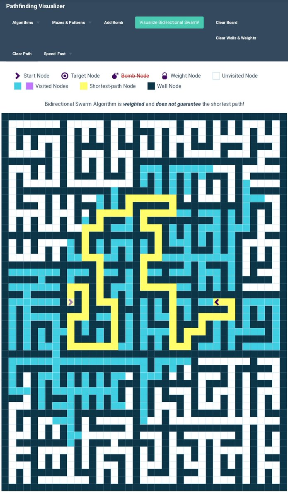
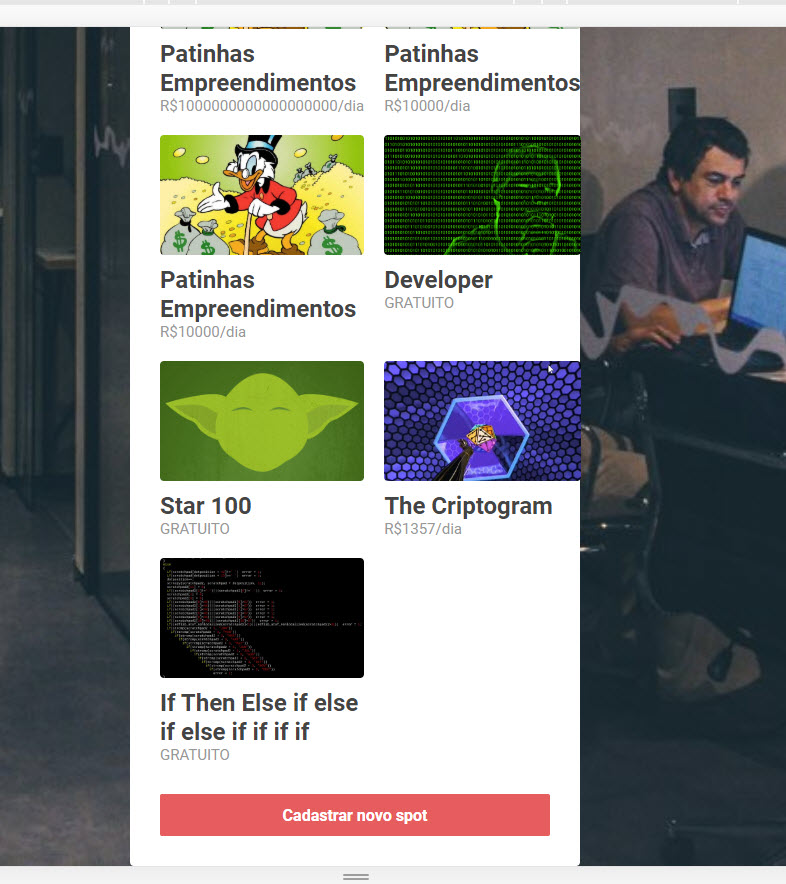
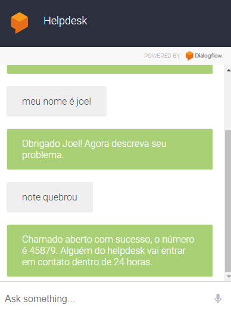

### 100DaysOfCode

## Day 15/101 -  13/10/2019 - Sunday - day
This page is amazing, about pathfindind algorithm
https://clementmihailescu.github.io/Pathfinding-Visualizer/#
#100DaysOfCode

https://www.hackathonsaustralia.com/

## Day 14/101 -  12/10/2019 - Sartuday- nigth to dawn
Solve labs on Cloud Hero
#100DaysOfMLCode
#100DaysOfCode

## Day 13/101 -  11/10/2019 - Fridday - nigth to dawn
Hacktoberfest !!! Time to resolve the pull requests from GitHub
toughs - Code and Beer! 
# https://hacktoberfest.digitalocean.com/

#100DaysOfCode 

## Day 12/101 -  10/10/2019 - Thursday - dawn
Working with scripts for webscrap like iMacros
toughs - raining here.
#100DaysOfCode 
#100DaysOfMLCode

## Day 11/101 -  09/10/2019 - Wednesday - nigth
No code today, just try read a little and listen this funny music
toughs - this old book doesn´t have any line of code at all! Just math. The cat´s name is MIA.

#100DaysOfCode #100DaysOfMLCode

## Day 11 -  09/10/2019 - Wednesday - nigth
No code today, just try read a little and listen this funny music
toughs - this old book doesn´t have any line of code at all! Just math. The cat´s name is MIA.
https://youtu.be/mB5vc_OiQv8
#100DaysOfCode #100DaysOfMLCode

## Day 10 -  08/10/2019 - Tuesday - nigth
Getting some labs on GCP
Toughts - I think that use GCP is not do the code because is a platform! Maybe I've to back with simple java programs ? Wow ten days!!! HORRAAYYY!!! 🚀
#100DaysOfCode 

## Day 9 -  07/10/2019 - Monday - 
Made with ReactJS
Toughts - Sleep, sleep, sleep
#100DaysOfCode

## Day 8 -  06/10/2019 - Sunday - dawn
Applying ReactJS
Toughts - I think that ReacJS is new Struts, all made in javascript
#100DaysOfCode

## Day 7 -  05/10/2019 - Saturday 
Creating a chatboot with dialogflow 
Toughts - I didn´t know how easy is creating a chabot, cool!
#100DaysOfCode

https://twitter.com/JoelMel28866244/status/1180648105127137280

## Day 6 - 04/10/2016 - Friday 
End Omnistack camp! Air Cnc - "Air Code and Coffe" 🚀🚀
Toughs - Node + React + React Native => Dopamina Burst´s
#omnistacknextlevel #100DaysOfCode

## Day 5 - 03/10/2016 - Thursday
App with React and React Native
Toughs - next week I´ll take https://100daysofcode.com lesson´s I don´t wanna give the OmniStack from RocketSeat and I did´n like break the 2º rule. 
#100DaysOfCode

 

## Day 4 - 02/10/2016 - Wednesday  
Revisiting Node.js

## Day 3 - 01/10/2016 - Tuesday -near 00:00 of 02/10/2016
Relearning basic rules of javascript, ES6+...

## Day 2 - 30/10/2016 - Monday - near 00:00 of 01/10/2016
Solve problem from Daily Coding Problem site
Regiter for week of omnistack from  https://rocketseat.com.br/ 

## Day 1 - 30/09/2019 -Monday - a couple minutes after begin of day 00:05
Getting the first problems, doubts about use Eclipse or VSCode, java or python, java 7 or 8, python 2 or 3, javascript or ecma script (I´m kidding here) ?
Toughs - how to take recursive functions to limit!
#100DaysofCode

## Day 0 - 29/09/2019 - Sunday
Discovery about 100 days of code, inenviroment setup, english plan and fill the "patience"
