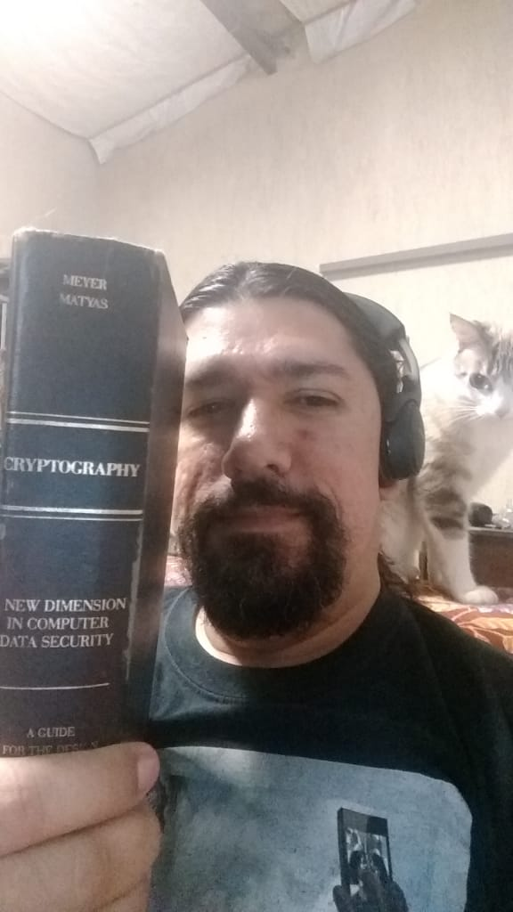

### 100DaysOfCode
Microsoft Power BI para Data Science
https://www.youtube.com/watch?v=NYbNeNl6eAk

kubectl get pods 

## Day 74/108 - 12/12/2019- Tuesday
Go to statistics, using covariance formula
http://ci.columbia.edu/ci/premba_test/c0331/s7/s7_5.html
#100DaysOfCode #Stats
#100DaysOfMLCode

## Day 73/108 - 11/12/2019- Tuesday
Go Flutter, I win a Dash 
<image src="./../img/4c3fe0f1-1f06-4338-b629-a7d9d3112f03.jpg">
#100DaysOfCode #AheadOfTime #Flutter
#100DaysOfMLCode

## Day 73/108 - 10/12/2019- Tuesday
Retrospectiva 2019 - 1 de 5:
Objetivos alcançados em 2019 com o Google Cloud:
400 Laboratórios, 20 quests, 23 cursos, 15 campeonatos mundiais, 3 vezes consecutivas no 1º lugar. Pense num cara que levou o "Hello world" a sério.
#100DaysOfCode
#100DaysOfMLCode
<image src="./../img/dfasdfasdfa.jpg">
            

## Day 72/108 - 09/12/2019-Monday
Time to change, welcome SSD! Is it make me code faster ? KKKKKKK
#100DaysOfCode
#100DaysOfMLCode
<image src="./../img/adfadsfa.jpeg">

## Day 71/108 - 08/12/2019-Sunday
CloudHero challenges, let's go due this on Cybercafe 
#100DaysOfCode
#100DaysOfMLCode
<image src="./../img/adfadsf.jpeg">

## Day 70/108 - 07/12/2019-Saturday
Excel rules all! 
#100DaysOfCode
#100DaysOfMLCode
<image src="./../img/WhatsApp Image 2019-12-06 at 23.14.39.jpeg">

## Day 69/108 - 06/12/2019-Friday
I´m doing some qwiklabs, kubernetes
#100DaysOfCode
#100DaysOfMLCode
<image src="./../img/j9Utrvl.jpg">

## Day 68/108 - 05/12/2019-Thursday
No code today, I need sleep and dreaming
#100DaysOfCode
#100DaysOfMLCode
<image src="./../img/images.jpg">
            
## Day 67/107 - 04/12/2019-Wednesday - day
Bad Day today, no code. :(
#100DaysOfCode
#100DaysOfMLCode
<image src="./../img/WhatsApp Image 2019-12-06 at 23.10.15.jpeg">

## Day 66/106 - 03/12/2019-Tuesday - night
Dinner and code!
#100DaysOfCode
#100DaysOfMLCode
<image src="./../img/20191203_204107.jpg">

## Day 65/106 - 02/12/2019-Monday
Wife birthday, no code today! I love you Bee Verbena!
#100DaysOfCode #BeeVerbena
#100DaysOfMLCode
https://www.beeverbena.com/
<image src="./../img/Bee_verbena2.jpeg">

## Day 64/105 - 01/12/2019-Sunday
Finished \o I know now how code a hello worl on the cloud! 😂😂😂 🚀🚀🚀
#100DaysOfCode
#100DaysOfMLCode
<image src="./../img/2019-12-02_20-32-26.jpg">
            

## Day 63/105 - 30/11/2019 - Saturday - night
BlackFriday experience, I purrchased a data science course from DataScienceAcademy with 50% discount, well, I´ll had a long way to finish the courses: Vidhya, Udemy, Coursera, Udacity, Qwiklabs, Microsoft´s.  Does anyone have time to sell ? ⌛⌛⌛
<image src="./../img/2019-11-30_23-10-17.jpg">
#100DaysOfCode
#100DaysOfMLCode

## Day 62/105 - 29/11/2019 - Friday - night
Finished a summarization of 400 excel´s files, powerquery I love you!
Next, I need make a simple app for update this files, I know that use excel´s files as database is awful, I need a SIMPLE solution for this: mongo atlas ? The offer 500Mb free of charge, access ? Power App,s need googling this. The pre requel is no develop system is tradicional way(React, Angular, PHP,...), thinkg man, think!
<image src="./../img/Power-Query-Grouping-and-Summarizing.png">
#100DaysOfCode
#100DaysOfMLCode

## Day 61/105 - 28/11/2019 - Thursday - night
Cloud OnBoard Application Development
Qwiklabs \o
<image src="./../img/saasdaimages.png">
#100DaysOfCode
#100DaysOfMLCode

## Day 60/105 - 27/11/2019 - Wednesday - day
My second devops lesson today, without net, without cloud. 
Let´s crimp this.
<image src="./../img/1ecfa5af-4a0f-42aa-96cb-ffeb6308b352.jfif">
#100DaysOfCode
#100DaysOfMLCode

## Day 59/105 - 26/11/2019 - Tuesday - night
My devops lesson today.
<image src="./../img/001921ad-2afd-49f2-9219-fa58082417e9.jfif">
#100DaysOfCode
#100DaysOfMLCode
            

## Day 58/105 - 25/11/2019 - Monday - night
 At the request of an NGO, which had its infrastructure destroyed by lightning, I did the entire service for recovery infrastructure free of charge. 
.
Helping others is good for you!
#100DaysOfCode
#volunteer 

At the request of an NGO, which had its infrastructure destroyed by lightning, it pulverized the telephone exchange.
. 
After cleaning the rack, servicing the servers / switches / consoles, replacing the UPS's batteries and redoing the network, as well as removing all the soot, the equipment was restored and returned to operation.
. 
I did the entire service free of charge and even offered advice for them to use Google Cloud. 
.
Note: Dell's Power Edge server has withstood the fire! Same with the melted plastic parts. Wow! .
#HelpYourNGO #ServiceVolunteer
#100DaysOfCode
#100DaysOfMLCode

<image src="./../img/IMG_20191123_143007804.jpg">

## Day 57/105 - 24/11/2019 - Sunday - night
Dart is Vader!! Flutter is seem a mess java+javascript+"Buullleerr!"
#100DaysOfCode
#100DaysOfMLCode

## Day 56/105 - 23/11/2019 - Saturday - night
Learning Flutter at Novatics
#100DaysOfCode
#100DaysOfMLCode

<image src="./../img/IMG_20191123_143007804.jpg">

## Day 55/105 - 22/11/2019 - Friday - night
Dynamics tables on power query
#100DaysOfCode
#100DaysOfMLCode

## Day 57/105 - 24/11/2019 - Sunday - night
Dart is Vader!! Flutter is seem a mess java+javascript+"Buullleerr!"
#100DaysOfCode
#100DaysOfMLCode

## Day 56/105 - 23/11/2019 - Saturday - night
Learning Flutter at Novatics
#100DaysOfCode
#100DaysOfMLCode

<image src="./../img/kkk0.jpg">

## Day 55/105 - 22/11/2019 - Friday - night
Dynamics tables on power query
#100DaysOfCode
#100DaysOfMLCode

## Day 54/105 - 21/11/2019 - Thursday - night
Functional Language is powerfull, I had to change my mindset for use it with better results, I remake a project three times !!! Now is easy to understanding and had good performance.
 #100DaysOfCode
#100DaysOfMLCode

## Day 53/105 - 20/11/2019 - Wednesday - dawn
Meetup - AI with PyTorch by  Developer Circles from Facebook
<image src="./../img/194c9164-2540-45a0-b5e8-94fb6da424f9.jfif">
 #100DaysOfCode
#100DaysOfMLCode

## Day 52/105 - 19/11/2019 - Tuesday -day
My HD scratched 😭
<image src="./../img/WhatsApp Image 2019-11-19 at 09.02.13.jpeg">

## Day 51/105 - 18/11/2019 - Monday -day
unmashed data on Power Query[2], I like that.
#100DaysOfCode
#100DaysOfMLCode

## Day 50/105 - 17/11/2019 - Sunday -day
unmashed data on Power Query 
#100DaysOfCode
#100DaysOfMLCode

## Day 49/105 - 16/11/2019 - Saturday - day
Bad Day... My HD crash! I´m very sad, all my project´s was gone😠😡🤬😫😖😭😭😭😭😭😭, the HD crashed on backup! ON BACKUP! 
I´m Struggled! 

## Day 48/104 - 15/11/2019 - Friday -day
Power Query continue
#100DaysOfCode
#100DaysOfMLCode
 
## Day 47/104 - 14/11/2019 - Thursday - day
Getting all excel files in M language, bye Macros.
Is there a better way to get excell data an put in a database and make a app? Sugestions ? PowerApp, PowerPIVOT? No macros ok, no macros.

#100DaysOfCode
#100DaysOfMLCode 

## Day 46/104 - 13/11/2019 - Wednesday - day
PowerQuery on Excel 2016, I learned that you need a KB4462115 update for unlock features:
excel2016-kb4462115-fullfile-x64-glb.exe download and install
#100DaysOfCode
#100DaysOfMLCode 

## Day 45/104 - 12/11/2019 - Tuesday - day
Machine Learning exercises

## Day 44/104 - 11/11/2019 - Monday - day
FreeCodeCamp exercises
#100DaysOfCode
#100DaysOfMLCode

## Day 43/104 - 10/11/2019 - Sunday - day
Studying statistics on python
#100DaysOfCode
#100DaysOfMLCode 

## Day 42/104 - 09/11/2019 - Saturday - day
Making anohter app in React, to get more skill, get the done, to get faster!
#100DaysOfCode
#100DaysOfMLCode 

## Day 41/104 - 08/11/2019 - Friday - day
Studying ML from udacity
#100DaysOfCode
#100DaysOfMLCode 

## Day 39/104 - 06/11/2019 - Wednesday - day
Hello World with PowerApp from Microsoft
#100DaysOfCode
#100DaysOfMLCode 

## Day 38/104 - 05/11/2019 - Tuesday - day
Finished a ReactNative app, thanks #rocketseat
<image src="./../img/1_lhkCOodCMZ0-hjjjjkhjk.png">
#100DaysOfCode
#100DaysOfMLCode 

## Day 37/104 - 04/11/2019 - Monday - day
Thank you Hacktoberfest 2019 ! For learning how contribute to community
<image src="./../img/2019-11-03_22-46-34.jpg">
#Hacktoberfest
#100DaysOfCode
#100DaysOfMLCode 

## Day 36/104 - 03/11/2019 - Sunday - day
Getting some exercises  on freecodecamp and udacity
#100DaysOfCode
#100DaysOfMLCode 

## Day 35/104 - 02/11/2019 - Saturday - day
Getting qwiklab´s and sciende dataset to BigQuery
#100DaysOfCode
#100DaysOfMLCode 

## Day 34/104 - 01/11/2019 - Friday - day
Making a app with ReactNative
#100DaysOfCode
#100DaysOfMLCode 

## Day 33/104 - 31/10/2019 - Thursday - day
Learning the basis again tree, trie, n-tree, patricia, so on.
https://www.geeksforgeeks.org/trie-insert-and-search/
#100DaysOfCode
#100DaysOfMLCode 

## Day 32/104 - 30/10/2019 - Wednesday - day
Updating my ML model in AWS Deep Racing 
Keep practice!
 
#100DaysOfCode
#100DaysOfMLCode 
#AWSDeepRacer
 
<image src="./../img/deepracer-reinvent-chrome-udacity-medium.png">
 
## Day 31/104 - 29/10/2019 - Tuesday - day
Make contributions for github repositories 
Python, C and Java.
I´m like do this, get the issues and make pull request´s
Keep practice!
 
#100DaysOfCode
#Hacktoberfest
 

## Day 30/104 - 28/10/2019 - Monday - day
Make my first contribution for https://github.com/twilio-labs/open-pixel-art 
Keep practice!
 
#100DaysOfMLCode 
#100DaysOfCode
#Hacktoberfest
 
<image src="./../img/2019-10-28_13-01-43.jpg">

## Day 29/104 - 27/10/2019 - Sunday - day/night
Getting some practive on github, pullrequest´s, rebase, making mistakes for fun(delete project´s, mess merges, brach´s commit error´s) and learning. 
#100DaysOfMLCode 
#100DaysOfCode
 
<image src="./../img/aaaaaagiphy.gif">

## Day 28/104 - 26/10/2019 - Sartuday - day
DEVFest2019 by Google 

#100DaysOfMLCode 
#100DaysOfCode
#DEVFest2019
<image src="./../img/devfest209.jpg">

## Day 27/104 -25/10/2019 - Friday - night
3 in row! Marveloussssssss, first place again \o 
Cloud Hero One World Warm up: Development Arena 
🐬Overflowing  dopamine!!!😍 ✈✈✈ 
#100DaysOfMLCode #100DaysOfCode
<image src="./../img/2019-10-25_22-53-10.jpg">
 
## Day 27/104 -25/10/2019 - Friday - day
I get the first place again! Cloud Hero: Kubernetes 🚀🚀🚀 
<image src="./../img/2019-10-24_13-02-23.jpg">
#100DaysOfMLCode #100DaysOfCode
 
## Day 26/104 -24/10/2019 - Thursday - night
After work many times on GCP, I get the first place in Cloud Hero: Machine Learning Serverles 1.0 
Dopamine ? FULLLY! 
<image src="./../img/2019-10-25_22-26-32.jpg">
#100DaysOfMLCode #100DaysOfCode

## Day 25/104 -23/10/2019- Wednesday
Studying the zaproxy, a tool for test vulnerabilities on app´s, check in: 
https://github.com/ArquiteturaJoel/zaproxy 
Toughs - My computer recovered, only the basics like chrome, bookmark, extensions, sessions 
#100DaysOfMLCode #100DaysOfCode

## Day 24/104 -22/10/2019- Tuesday
Do somoe GCP labs on cloud hero(friend computer). 
My computer still down, I´m still recoverying data... 
#100DaysOfMLCode #100DaysOfCode

## Day 23/104 - Monday 21/10/2019
Computer crash yesterday, bought new SSD for my old FX8320e. 
It´s take a long time reinstalling all things

## Day 22/104 - Sunday- 20/10/2019
Computer crash..... bad, bad, bad HD.... it very old, more than 10 years.😱😱 
#100DaysOfMLCode #100DaysOfCode

## Day 21/102 -  19/10/2019 -Sartuday - morning
Quest´ on GCP, 2º place \o
#100DaysOfMLCode #100DaysOfCode

<image src="./../img/2019-10-19_12-06-23aa.jpg">

## Day 20/102 -  18/10/2019 - Fridday - dawn
I did some exercises on GCP III - Cloud Hero
#100DaysOfMLCode #100DaysOfCode

## Day 19/102 -  17/10/2019 - Thursday
I did some exercises on GCP II
#100DaysOfMLCode #100DaysOfCode

## Day 18/102 -  16/10/2019 - Wednesday
I did some exercises on GCP
#100DaysOfMLCode #100DaysOfCode

## Day 17/102 - 15/10/2019 - Tuesday
Doctor says that I had a burnout crisis, must stay 10 days in house, but a can do coding for fun. 
Happy end 0/ I think, 🤪 
#100DaysOfMLCode #100DaysOfCode

## Day 16/102 - 14/10/2019 - Monday
My boss doesn't let me programming. WHAT!😱😱  
He said programming is not welcome there,  
that I should be service desk only(my contract doesn't have that)  
It´s affected me deeply, I had a crisis attack.  
I´ll need a Doctor. 🥺😥   
#100DaysOfMLCode #100DaysOfCode

## Day 15/101 -  13/10/2019 - Sunday - day
This page is amazing, about pathfindind algorithm
https://clementmihailescu.github.io/Pathfinding-Visualizer/#
#100DaysOfCode

https://www.hackathonsaustralia.com/

## Day 14/101 -  12/10/2019 - Sartuday- nigth to dawn
Solve labs on Cloud Hero
#100DaysOfMLCode
#100DaysOfCode

## Day 13/101 -  11/10/2019 - Fridday - nigth to dawn
Hacktoberfest !!! Time to resolve the pull requests from GitHub
toughs - Code and Beer! 
# https://hacktoberfest.digitalocean.com/

#100DaysOfCode 

## Day 12/101 -  10/10/2019 - Thursday - dawn
Working with scripts for webscrap like iMacros
toughs - raining here.
#100DaysOfCode 
#100DaysOfMLCode

## Day 11/101 -  09/10/2019 - Wednesday - nigth
No code today, just try read a little and listen this funny music
toughs - this old book doesn´t have any line of code at all! Just math. The cat´s name is MIA.

#100DaysOfCode #100DaysOfMLCode

## Day 11 -  09/10/2019 - Wednesday - nigth
No code today, just try read a little and listen this funny music
toughs - this old book doesn´t have any line of code at all! Just math. The cat´s name is MIA.
https://youtu.be/mB5vc_OiQv8
#100DaysOfCode #100DaysOfMLCode

## Day 10 -  08/10/2019 - Tuesday - nigth
Getting some labs on GCP
Toughts - I think that use GCP is not do the code because is a platform! Maybe I've to back with simple java programs ? Wow ten days!!! HORRAAYYY!!! 🚀
#100DaysOfCode 

## Day 9 -  07/10/2019 - Monday - 
Made with ReactJS
Toughts - Sleep, sleep, sleep
#100DaysOfCode

## Day 8 -  06/10/2019 - Sunday - dawn
Applying ReactJS
Toughts - I think that ReacJS is new Struts, all made in javascript
#100DaysOfCode

## Day 7 -  05/10/2019 - Saturday 
Creating a chatboot with dialogflow 
Toughts - I didn´t know how easy is creating a chabot, cool!
#100DaysOfCode

https://twitter.com/JoelMel28866244/status/1180648105127137280

## Day 6 - 04/10/2016 - Friday 
End Omnistack camp! Air Cnc - "Air Code and Coffe" 🚀🚀
Toughs - Node + React + React Native => Dopamina Burst´s
#omnistacknextlevel #100DaysOfCode

## Day 5 - 03/10/2016 - Thursday
App with React and React Native
Toughs - next week I´ll take https://100daysofcode.com lesson´s I don´t wanna give the OmniStack from RocketSeat and I did´n like break the 2º rule. 
#100DaysOfCode

 

## Day 4 - 02/10/2016 - Wednesday  
Revisiting Node.js

## Day 3 - 01/10/2016 - Tuesday -near 00:00 of 02/10/2016
Relearning basic rules of javascript, ES6+...

## Day 2 - 30/10/2016 - Monday - near 00:00 of 01/10/2016
Solve problem from Daily Coding Problem site
Regiter for week of omnistack from  https://rocketseat.com.br/ 

## Day 1 - 30/09/2019 -Monday - a couple minutes after begin of day 00:05
Getting the first problems, doubts about use Eclipse or VSCode, java or python, java 7 or 8, python 2 or 3, javascript or ecma script (I´m kidding here) ?
Toughs - how to take recursive functions to limit!
#100DaysofCode

## Day 0 - 29/09/2019 - Sunday
Discovery about 100 days of code, inenviroment setup, english plan and fill the "patience"
